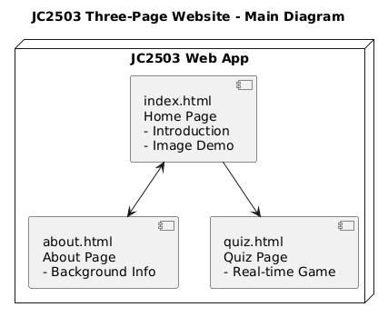
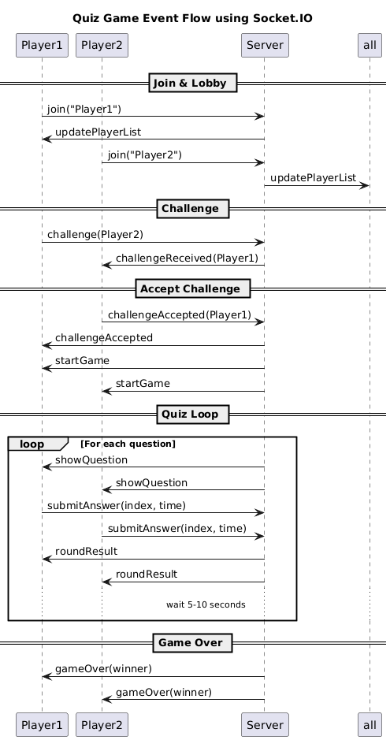

# JC2503 Web Coursework – Project Overview

## Web and Structure Inturaduction

This project is a simple three-page website built for the JC2503 module. It includes:

- **Home Page (`index.html`)**: Introduces the user and displays example images.
- **About Page (`about.html`)**: Presents further background information.
- **Quiz Page (`quiz.html`)**: Implements a real-time two-player quiz using Socket.IO, allowing users to join, challenge others, and answer timed questions.

All pages are styled using Bootstrap 5.3 and a custom `style.css`, with a consistent dark-themed layout and top navigation links.

## Communication and Event Handling

The quiz system uses **Socket.IO** to enable real-time communication between two players. Below is a breakdown of how it is used on both the front-end and back-end:

###  Client-side (Front-end: `quiz.js`)

- Uses `const socket = io();` to establish a persistent connection with the server.
- Listens to events from the server using `socket.on(...)` and reacts accordingly (e.g., displaying player list, questions, results).
- Sends user actions to the server via `socket.emit(...)`, such as:
  - `join`: Send username after login
  - `challenge`: Initiate a challenge to another player
  - `challengeAccepted`: Accept incoming challenge
  - `submitAnswer`: Send selected answer and timestamp

This enables responsive, event-driven updates during gameplay.

###  Server-side (Back-end: `server.js`)

- Uses `io.on("connection", socket => {...})` to manage each new client connection.
- Maintains player list and socket IDs using a `players` object.
- Handles and emits key events such as:
  - `updatePlayerList`: Broadcast current users
  - `challengeReceived`: Notify the challenged user
  - `startGame`, `showQuestion`: Initiate quiz flow for a matched pair
  - `submitAnswer`: Collect responses, score results
  - `roundResult`, `gameOver`: Send back outcome and final score

- Uses `socket.join(roomId)` and `io.to(roomId).emit(...)` to isolate each quiz match inside a private room, ensuring correct and synchronized communication.

## Reflection and Lessons Learned

This project presented a range of technical and architectural challenges that significantly deepened my understanding of full-stack development and real-time systems.

### Environment Setup Challenges

- **Missing Package Manager in Codio**: The Codio environment lacked a usable Node.js setup. I installed dependencies manually using `npm` and configured Node via NVM.
- **.bashrc Configuration**: I appended NVM setup code to `.bashrc` to load Node.js v16 and npm v8 automatically in every new terminal session.
- **Port Conflicts (`EADDRINUSE`)**: I encountered port 3000 being occupied, often due to residual processes. I used `netstat` and `kill -9` to resolve this, or alternatively changed to port 3001.

### Codio Platform Adjustments

- **Java Default Run Configuration**: Codio was initially configured for Java. I edited the `.codio` file to replace Java commands with `"npm start"` and adjusted the preview URL to launch the site properly.
- **Preview Port Limitation**: Since Codio only allows port 3000 to be previewed, I had to carefully manage server startups and avoid conflicts.

### Application Logic Debugging

- **Socket ID vs Username Mismatch**: I mistakenly used usernames for room IDs instead of socket IDs, which caused the game to break. Replacing them with socket IDs resolved the issue.
- **Bypassed Challenge Confirmation**: A missing `{}` block caused the `onclick` event to skip the `challengeReceived` logic. Fixing the syntax restored correct game flow.
- **Browser `confirm()` Issues**: Native `confirm()` dialogs caused unexpected behavior or blocking in some browsers. I replaced it with a Bootstrap modal for better control and cross-browser support.

### Automated Testing with Puppeteer

During testing, I discovered **Puppeteer**, a powerful headless browser automation framework for Node.js. I used it to simulate two players joining, challenging, answering questions, and completing the game loop. This made functional testing faster, more repeatable, and more readable.

By integrating Puppeteer into the development process, I gained valuable experience in writing automated tests that mirror actual user behavior. It also highlighted the importance of testability in real-time applications, and improved the overall maintainability of my project.

## References and GenAI Usage Declaration

### References 

Bootstrap, 2024. *Bootstrap 5.3 Documentation*. [online] Available at: <https://getbootstrap.com/> [Accessed 28 May 2025].

MDN Web Docs, 2025. *HTML, CSS, and JavaScript documentation*. [online] Available at: <https://developer.mozilla.org/> [Accessed 28 May 2025].

NVM, 2024. *Node Version Manager (NVM)*. [online] Available at: <https://github.com/nvm-sh/nvm> [Accessed 28 May 2025].

PlantUML, 2024. *PlantUML Standard Language Reference*. [online] Available at: <https://plantuml.com/> [Accessed 28 May 2025].

Puppeteer, 2025. *Puppeteer Documentation*. [online] Available at: <https://pptr.dev/> [Accessed 28 May 2025].

Socket.IO, 2025. *Socket.IO Official Documentation*. [online] Available at: <https://socket.io/docs/> [Accessed 28 May 2025].

猫爪博客, 2025. *梗图 – 猫爪博客*. [online] Available at: <https://xn--o1qx19eeqi.cn/%E6%A2%97%E5%9B%BE> [Accessed 28 May 2025].

---

### GenAI Usage Declaration

This project includes selective support from **ChatGPT (OpenAI)** in line with the University of Aberdeen’s academic integrity policy. GenAI was used in the following ways:

- Clarifying technical concepts and debugging patterns  
- Structuring the documentation and README file  
- Generating Socket.IO event flow diagrams using PlantUML  
- Assisting in writing Puppeteer test scripts and fixing asynchronous logic  

All AI-assisted content was reviewed, verified, and modified where necessary to ensure full understanding and ownership. No AI-generated material was submitted without comprehension or personal adaptation.
